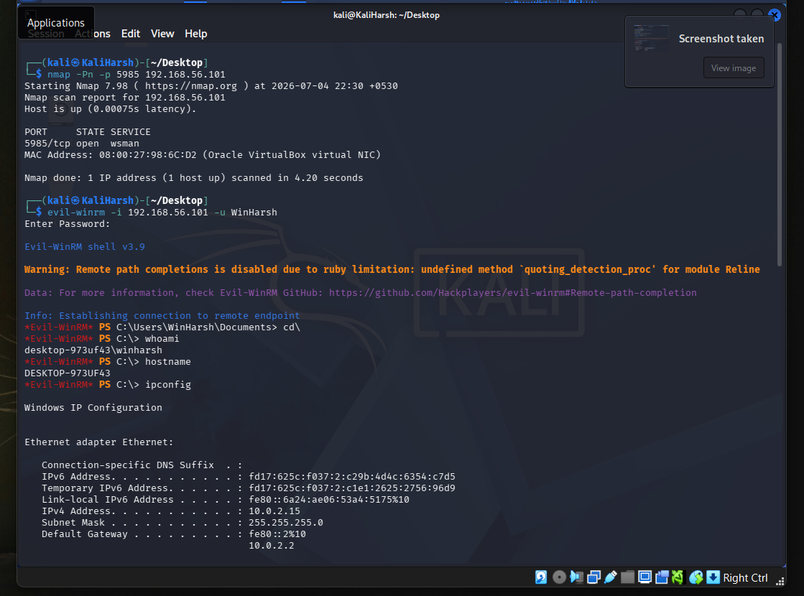
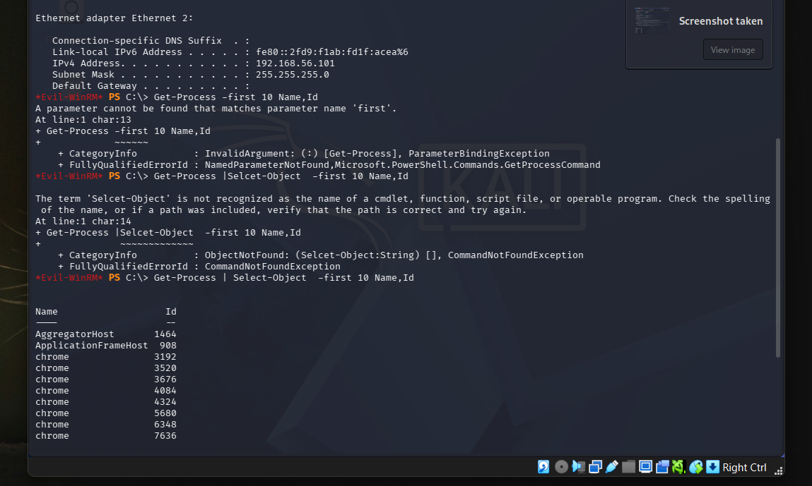
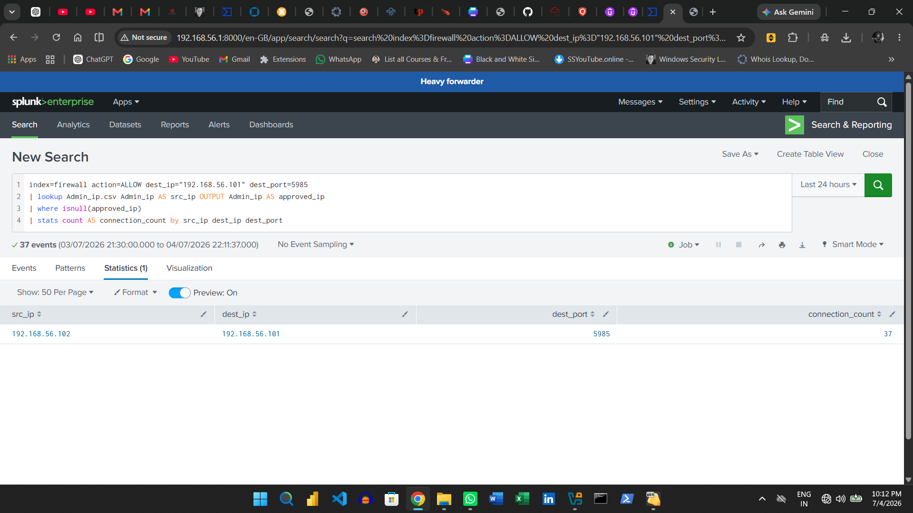
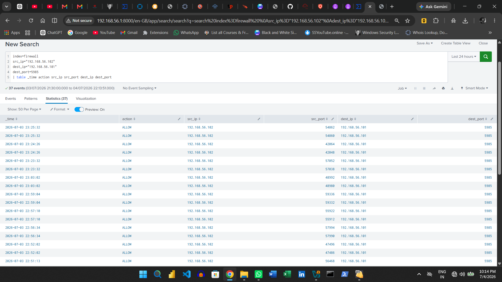
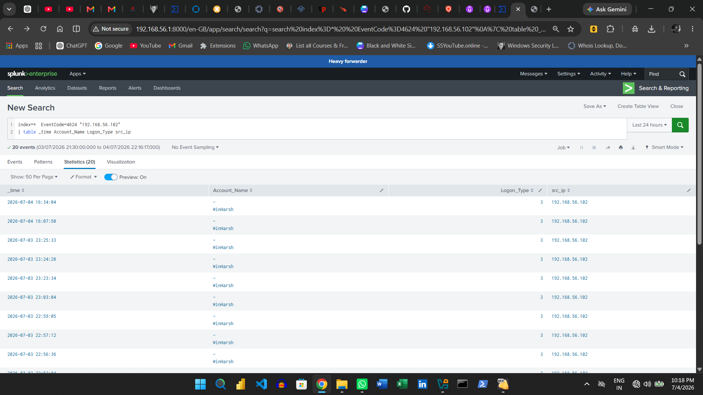
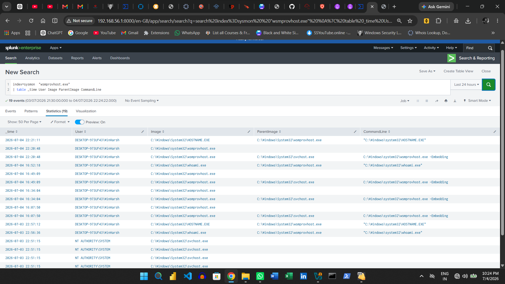
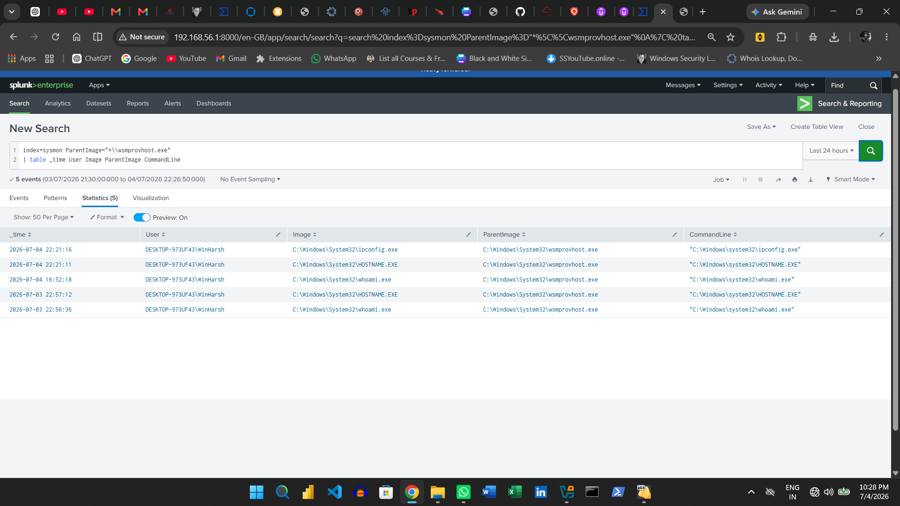

# Possible Unauthorized WinRM Access Investigation Using Splunk

## Project Overview

This project demonstrates the detection and investigation of a possible unauthorized Windows Remote Management connection from an unusual source IP.

A Kali Linux system with IP address `192.168.56.102` connected to a Windows endpoint at `192.168.56.101` over WinRM TCP port `5985` using Evil-WinRM.

The source IP was intentionally excluded from the approved administrator lookup file, `Admin_ip.csv`, so that Splunk would identify it as an unusual source.

The activity was performed inside an isolated and authorized SOC home lab.

---

## Project Objective

The objective of this project was to:

* Detect allowed WinRM traffic from an unapproved source IP.
* Compare source IP addresses against an administrator IP lookup.
* Investigate successful remote authentication.
* Confirm WinRM-hosted remote activity using Sysmon.
* Analyze the parent-child process relationship involving `wsmprovhost.exe`.
* Document the incident using a SOC investigation workflow.

---

## Lab Environment

| Component     | Role                            | IP Address       |
| ------------- | ------------------------------- | ---------------- |
| Kali Linux VM | Simulated unusual remote source | `192.168.56.102` |
| Windows VM    | Target endpoint                 | `192.168.56.101` |
| Windows Host  | Splunk SIEM server              | `192.168.56.1`   |

### Tools and Technologies

* Kali Linux
* Evil-WinRM
* Windows Remote Management
* Windows Defender Firewall logs
* Windows Security logs
* Sysmon
* Splunk Enterprise Free
* Splunk Universal Forwarder

---

## Attack Scenario

The Kali Linux VM connected to the Windows endpoint using Evil-WinRM:

```bash
evil-winrm -i 192.168.56.101 -u WinHarsh -p 'LAB-PASSWORD'
```

After establishing the remote PowerShell session, basic system-discovery commands were executed:

```powershell
whoami
hostname
ipconfig
```

The activity represented a possible remote-access scenario involving valid credentials and an unusual source IP.

---

## Attack Flow

```text
Kali Linux — 192.168.56.102
        |
        | WinRM TCP 5985
        v
Windows VM — 192.168.56.101
        |
        | Successful remote authentication
        v
wsmprovhost.exe
        |
        | Remote PowerShell session
        v
System discovery commands
```

---

## Approved Administrator Lookup

The lookup file `Admin_ip.csv` contained the approved administrator IP range:

```csv
Admin_ip
192.168.56.1
192.168.56.2
192.168.56.3
...
192.168.56.25
```

The Kali Linux IP address `192.168.56.102` was not included in the lookup and was therefore classified as unusual.

---

## Detection SPL

The following query identifies allowed WinRM connections from source IP addresses that are not present in the approved administrator lookup:

```spl
index=firewall action=ALLOW dest_ip="192.168.56.101" dest_port=5985
| lookup Admin_ip.csv Admin_ip AS src_ip OUTPUT Admin_ip AS approved_ip
| where isnull(approved_ip)
| stats count AS connection_count by src_ip dest_ip dest_port
```

### Detection Logic

```text
Search allowed WinRM traffic
        ↓
Compare src_ip with Admin_ip.csv
        ↓
Keep events where no lookup match exists
        ↓
Display the unusual source IP
```

### Detection Result

The query returned:

| Field                 | Value            |
| --------------------- | ---------------- |
| Source IP             | `192.168.56.102` |
| Destination IP        | `192.168.56.101` |
| Destination Port      | `5985`           |
| Source Classification | Unusual          |
| Firewall Action       | ALLOW            |

---

## Investigation Process

### 1. Firewall Investigation

The following query confirmed the allowed WinRM connection:

```spl
index=firewall 
src_ip="192.168.56.102"
dest_ip="192.168.56.101"
dest_port=5985
| table _time action src_ip src_port dest_ip dest_port
```

The firewall logs confirmed that traffic from `192.168.56.102` to TCP port `5985` was allowed.

---

### 2. Authentication Investigation

Windows Security logs were reviewed for successful authentication activity:

```spl
index=*  EventCode=4624 "192.168.56.102"
| table _time Account_Name Logon_Type src_ip
```

The investigation confirmed that the `WinHarsh` account was used to establish the remote session.

A network-based WinRM authentication is commonly recorded as Logon Type `3`.

---

### 3. WinRM Process Investigation

Sysmon logs were reviewed for the Windows Remote Management Provider Host process:

```spl
index=sysmon  "wsmprovhost.exe"
| table _time User Image ParentImage CommandLine
```

The process was observed at:

```text
C:\Windows\System32\wsmprovhost.exe
```

`wsmprovhost.exe` is a legitimate Windows process used to host remote PowerShell sessions through WinRM.

---

### 4. Parent-Child Process Investigation

Processes launched through the WinRM session were reviewed using:

```spl
index=sysmon  ParentImage="*\\wsmprovhost.exe"
| table _time User Image ParentImage CommandLine
```

Observed or expected process relationships included:

```text
wsmprovhost.exe → whoami.exe
wsmprovhost.exe → hostname.exe
```

This parent-child process relationship supported the conclusion that commands were executed through a remote WinRM session.

PowerShell cmdlets such as `Get-ChildItem` can execute inside the existing PowerShell runspace and may not create separate Sysmon process events.

---

## Investigation Findings

The investigation established that:

* `192.168.56.102` connected to `192.168.56.101` over TCP port `5985`.
* Windows Firewall allowed the connection.
* The source IP was not present in the approved administrator lookup.
* The `WinHarsh` account successfully established a remote session.
* Evil-WinRM was used to access the target endpoint.
* Sysmon recorded activity associated with `wsmprovhost.exe`.
* Remote system-discovery commands were executed.
* No malware, persistence, credential theft, or destructive activity was observed.

---

## Incident Classification

| Field            | Value                                                        |
| ---------------- | ------------------------------------------------------------ |
| Alert Name       | Possible Unauthorized WinRM Access from an Unusual Source IP |
| Incident Type    | Suspicious Remote Access                                     |
| Severity         | Medium                                                       |
| Source IP        | `192.168.56.102`                                             |
| Destination IP   | `192.168.56.101`                                             |
| Destination Port | `5985/TCP`                                                   |
| User Account     | `WinHarsh`                                                   |
| Verdict          | True Positive — Authorized Lab Simulation                    |
| Business Impact  | None                                                         |
| Status           | Closed                                                       |

---

## MITRE ATT&CK Mapping

| Technique                 | ID        | Description                                       |
| ------------------------- | --------- | ------------------------------------------------- |
| Windows Remote Management | T1021.006 | Remote access and command execution through WinRM |
| PowerShell                | T1059.001 | Command execution through PowerShell              |

---

## Evidence Screenshots

### 1. Evil-WinRM Connection from Kali



### 2. Remote Discovery Commands



### 3. Unauthorized WinRM Detection



### 4. WinRM Firewall Activity



### 5. Successful Network Logon



### 6. WinRM Provider Host Activity



### 7. Remote Command Execution



---

## Recommended Remediation

For a genuine unauthorized WinRM event:

* Confirm whether the user and source IP are approved.
* Reset or disable the affected account if compromise is suspected.
* Restrict WinRM access to approved administrator IP addresses.
* Investigate all processes launched by `wsmprovhost.exe`.
* Search for additional activity from the same source IP and account.
* Disable WinRM on systems where remote administration is not required.
* Monitor unusual connections to ports `5985` and `5986`.
* Use approved administrative workstations or jump servers.
* Maintain and regularly review the administrator IP allowlist.

---

## Repository Structure

```text
SOC-Unauthorized-WinRM-Access-Investigation-Splunk/
│
├── README.md
├── lookups/
│   └── Admin_ip.csv
├── spl-queries/
│   └── winrm-investigation.spl
├── incident-report/
│   └── incident-report.md
└── screenshots/
     ├── 01-kali-attack.png
     ├── 02-kali-attack.png
     ├── 03-unauthorized-winrm-alert.png
     ├── 04-winrm-firewall-activity.png
     ├── 05-successful-logon-4624.png
     ├── 06-wsmprovhost-activity.png
     └── 07-remote-command-execution.png
```

---

## Project Limitation

Splunk Enterprise Free was used in this project.

The detection condition was identified by manually executing the SPL query. Automatic alert triggering was not available under the Free license.

The project therefore demonstrates manual alert simulation, investigation, evidence correlation, and incident documentation.

---

## Final Conclusion

The investigation confirmed that source IP `192.168.56.102` established an allowed WinRM connection to Windows endpoint `192.168.56.101` over TCP port `5985`.

The source IP was not present in the approved administrator lookup and was correctly identified as unusual. Successful authentication and Sysmon process evidence confirmed that a remote WinRM PowerShell session was active.

The detection logic operated as expected, and the event was classified as a **True Positive — Authorized Lab Simulation**.

---

## Disclaimer

This project was performed in an isolated and authorized cybersecurity home lab.

The Kali Linux source IP was intentionally excluded from the approved administrator lookup to simulate a potentially unauthorized WinRM connection. No unauthorized external systems were accessed, and no malicious impact occurred.

